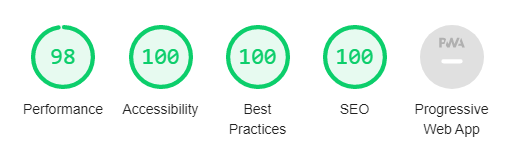

# Weston Snapshots! - [Live Site](https://lukebinmore.github.io/Weston-Snapshots/index.html)

**Weston Snapshots** is a site aimed at those based in Weston-super-Mare with a passion or interest in photography, looking to join a club/community of people with the same or similar interests.

The purpose of the site is to provide a point of contact for the club/community for new comers and interested members, as well as to act as an advertisement and informational page regarding the group and it's activities.

## Features

### Existing Features

* __Site Home Button And Title__ 
  * This feature is found on every page of the site, and allows the user a quick and easy method of returning to the home page from any point in the site.
  * Site pages included: Home, Gallery, Members, Join Us!
  * This feature is responsive in design, and will remain at the top of the screen when scrolling unless on a small screen.

* __Nagigation Menu__
  * The navigation menu can be found on every page, and provides the user with the ability to easily navigate to any page on the site.
  * Site pages included: Home, Gallery, Members, Join Us!
  * This feature is responsive in design, and will remain at the top of the page when scrolling unless on small screens.

* __Page Heading__
  * The page heading is present on every page, and provides some subtext to the current page.
  * This feature includes:
    * A panorama image showing off some members photos of Weston-super-Mare's seafront.
    * A page heading.
    * A short and interesting phrase relating to the page content.

* __Footer__
  * The footer features provides quick access to social media sites relevant to Weston Snapshots.
  * Social sites included:
    * Facebook
    * Twitter
    * Youtube
    * Instagram
  * This feature encourages the user to keep up with the social offerings of the Weston Snapshots club/community.

* __Club Ethos__
  * The club ethos section of the home page provides the user with some information about the club/community, and what they are about.
  * The aim of this section is to inform the user of what kinds of people make up the club/community, What they do when they meet, and how to join the club/community.

* __Club Schedule__
  * The schedule section on the home page outlines the normal schedule of the club/community, demonstrating when they meet and what they do on those days.
  * This section should be updated if/when these times/activities change

* __Gallery__
  * The gallery has been implemented to provide a space to show off photos taken by members, and to show interested members what subjects are usually on the end of the cameras.
  * This feature is valuble for the user as it provides the user with some scope of the following:
    * The capability of the current members
    * The amount they can learn and improve with the help of the group
    * The beautifull sites and locations in Weston-super-Mare that are ready and waiting to be photographed

* __Members Page__
  * The members page shows the names and pictures of the current members (Those that have agreed to be included).
  * This is valuble for the user, as it shows the diversity in age, gender and backgrounds of the community, showing the club/community is inclusive of everyone.

* __Join Us Page__
  * The signup page provides the user with a form to fill in to join the community and get started on their photography journey.
  * On completing the form, the user is taken to a thanks page that let's them know what will happen next, and thank them for joining.

### Future Features

* __Gallery Image Slider__
  * This possible feature would present the user with an image scroller when clicking on an image in the gallery.
  * This would allow the user to view images in a larger format, and allow them to scroll through the images one by one.

* __Schedule Calendar Link__
  * This possible feature would offer the user an iCal link to the schedule, allowing them to add it to their own calendars with an updating link.

* __Gallery Members Filter__
  * This would allow user's to filter the gallery to photos taken by a specific member.

## Technologies Used

### Languages

* HTML5
* CSS3

### Stylings/Theme

* [Google Fonts](https://fonts.google.com/)
  * Font's used for site:
    * Anton
    * Comfortaa
* [Font Awesome](https://fontawesome.com/)
  * Icon's used across the site:
    * Home Button
    * Schedule Icons
    * Social Links
* [Gauger.io](https://gauger.io/fonticon/)
  * Converter for Font Awesome icons to images
    * Used to create image for favicon

### Image Compression / Manipulation

* [Microsoft Photos](https://www.microsoft.com/en-gb/p/microsoft-photos/9wzdncrfjbh4?activetab=pivot:overviewtab)
  * Used to crop members images to correct aspect ratio
* [Adobe Photoshop CS6](https://www.adobe.com/uk/products/photoshop/landpa.html?gclid=CjwKCAiAm7OMBhAQEiwArvGi3DRoI4vzKuV46NP2gcY9uP-qUOFlsKnFpoS04HTPL7CH9dAaM9oYBBoCwRMQAvD_BwE&mv=search&mv=search&sdid=LZ32SYVR&ef_id=CjwKCAiAm7OMBhAQEiwArvGi3DRoI4vzKuV46NP2gcY9uP-qUOFlsKnFpoS04HTPL7CH9dAaM9oYBBoCwRMQAvD_BwE:G:s&s_kwcid=AL!3085!3!520876516732!e!!g!!adobe%20photoshop%20cs6!1422700211!58647953911)
  * Used to compress and convert images into .jpg

### Project Management

* [GitHub](https://github.com/)
  * Used for version control, hosting and deployment
* [Visual Studio Code](https://code.visualstudio.com/)
  * IDE used for development of site

### Learning/Information Resources

* [W3Schools](https://www.w3schools.com/)
  * Used for discovering specific element properties
* [Stack Overflow](https://stackoverflow.com/)
  * Used for discovering specific element properties

## Testing

### Automated Testing

#### [Chrome DevTools - Lighthouse Report](https://developer.chrome.com/docs/devtools/)

**Summary:**

* Desktop:
  * All pages have reduced performance score due to image file sizes and format.
    * Improved by compressing and converting all images to .jpg.
  * All pages have 3% loss on accessibility score, due to home icon link in top left corner not having decernable text.
    * Fixed by adding aria-label to icon.
  * All pages have a best practice score of 100.
  * All pages have an SEO score of 100.

* Mobile:
  * All pages have reduced performance score due to image file sizes.
    * Improved with futher compression.
  * Join Us Thanks page has drastically reduced performance score due to large icon.
    * Fixed by replacing icon with image.
  * All pages have an accessibility score of 100.
  * All pages have a best practice score of 100.
  * All pages have an SEO score of 100.

View Results

* **Desktop Mode:**

**Home**

**Gallery**

**Members**

**Join Us - Form**

**Join Us - Thanks**

* **Mobile Mode:**

**Home**

**Gallery**

**Members**

**Join Us - Form**

**Join Us - Thanks**

#### Validator Testing

##### Summary:

All HTML and CSS pages passed validators with no errors or warnings.

View Results

* HTML
  * [Index](https://lukebinmore.github.io/Weston-Snapshots/index.html)
    * No errors or warnings were returned when passing through the official [W3C Validator](https://validator.w3.org/nu/?doc=https%3A%2F%2Flukebinmore.github.io%2FWeston-Snapshots%2Findex.html)
  * [Gallery](https://lukebinmore.github.io/Weston-Snapshots/pages/gallery.html)
    * No errors or warnings were returned when passing through the official [W3C Validator](https://validator.w3.org/nu/?doc=https%3A%2F%2Flukebinmore.github.io%2FWeston-Snapshots%2Fpages%2Fgallery.html)
  * [Members](https://lukebinmore.github.io/Weston-Snapshots/pages/members.html)
    * No errors or warnings were returned when passing through the official [W3C Validator](https://validator.w3.org/nu/?doc=https%3A%2F%2Flukebinmore.github.io%2FWeston-Snapshots%2Fpages%2Fmembers.html)
  * [Joinus Form](https://lukebinmore.github.io/Weston-Snapshots/pages/joinus-form.html)
    * No errors or warnings were returned when passing through the official [W3C Validator](https://validator.w3.org/nu/?doc=https%3A%2F%2Flukebinmore.github.io%2FWeston-Snapshots%2Fpages%2Fjoinus-form.html)
  * [Joinus Thanks](https://lukebinmore.github.io/Weston-Snapshots/pages/joinus-thanks.html)
    * No errors or warnings were returned when passing through the official [W3C Validator](https://validator.w3.org/nu/?doc=https%3A%2F%2Flukebinmore.github.io%2FWeston-Snapshots%2Fpages%2Fjoinus-thanks.html)

* CSS
  * [Index](https://lukebinmore.github.io/Weston-Snapshots/index.html)
    * No errors or warnings were returned when passing through the official [(Jigsaw) Validator](https://jigsaw.w3.org/css-validator/validator?uri=https%3A%2F%2Flukebinmore.github.io%2FWeston-Snapshots%2Findex.html&profile=css3svg&usermedium=all&warning=1&vextwarning=&lang=en)
  * [Gallery](https://lukebinmore.github.io/Weston-Snapshots/pages/gallery.html)
    * No errors or warnings were returned when passing through the official [(Jigsaw) Validator](https://jigsaw.w3.org/css-validator/validator?uri=https%3A%2F%2Flukebinmore.github.io%2FWeston-Snapshots%2Fpages%2Fgallery.html&profile=css3svg&usermedium=all&warning=1&vextwarning=&lang=en)
  * [Members](https://lukebinmore.github.io/Weston-Snapshots/pages/members.html)
    * No errors or warnings were returned when passing through the official [(Jigsaw) Validator](https://jigsaw.w3.org/css-validator/validator?uri=https%3A%2F%2Flukebinmore.github.io%2FWeston-Snapshots%2Fpages%2Fmembers.html&profile=css3svg&usermedium=all&warning=1&vextwarning=&lang=en)
  * [Joinus Form](https://lukebinmore.github.io/Weston-Snapshots/pages/joinus-form.html)
    * No errors or warnings were returned when passing through the official [(Jigsaw) Validator](https://jigsaw.w3.org/css-validator/validator?uri=https%3A%2F%2Flukebinmore.github.io%2FWeston-Snapshots%2Fpages%2Fjoinus-form.html&profile=css3svg&usermedium=all&warning=1&vextwarning=&lang=en)
  * [Joinus Thanks](https://lukebinmore.github.io/Weston-Snapshots/pages/joinus-thanks.html)
    * No errors or warnings were returned when passing through the official [(Jigsaw) Validator](https://jigsaw.w3.org/css-validator/validator?uri=https%3A%2F%2Flukebinmore.github.io%2FWeston-Snapshots%2Fpages%2Fjoinus-thanks.html&profile=css3svg&usermedium=all&warning=1&vextwarning=&lang=en)

### Manual Testing

##### Summary:

A wide range of manual tests were carried out during the development of the site, and after completion both on desktop and mobile to confirm no bugs or issues remained.
These tests were carried out on multiple devices, both physical and simulated, as well as in multiple browsers.
All tests carried out: **PASSED**

Devices Tested

Simulated devices tested using [Chrome DevTools](https://developer.chrome.com/docs/devtools/)

* Physical Devices
  * Desktop PC (Windows 10)
  * Macbook Pro (OSX)
  * Samsung Galaxy S10+ (Android)
  * iPhone 11 (IOS)
  * Kindle Fire Tablet (FireOS)
* Simulated Devices
  * Moto G4
  * Nexus 10
  * Pixel 2
  * Pixel 2 XL
  * iPhone 5/SE
  * iPhone 6/7/8
  * iPhone 6/7/8 Plus
  * iPhone X
  * iPad
  * iPad Pro
  * Surface Duo
  * Nest Hub
  * Nest Hub Max

Browsers Tested

* Chrome
* Edge
* Firefox
* Opera
* Safari
* Silk Browser

View Tests

Functional Tests

* Site Header
  * Check if header stays fixed when scrolling
  * Check if content is not hidden behind header
* Home Icon
  * Check if link takes user back to the home page on all pages
  * Check if the icon loads on all pages
* Site Title
  * Check if spelling is correct
  * Check if positioning is correct
* Navigation Menu
  * Check if list shows in correct order
  * Check if list is aligned properly on all pages
  * Check if items link to correct pages
  * Check if items change when hovered over
  * Check if items change when on that page
* Footer
  * Check if footer stays fixed at bottom of window
  * Check if content is not hidden behind footer
* Social Links
  * Check if all social links take user to correct site
  * Check if all links open in new tab
  * Check if all icons are aligned properly
* Page Banners
  * Check if all pages load banner image correctly
  * Check if all pages banner is correctly sized and aligned
  * Check if all banners have unique heading
  * Check if all banners have unique phrase
  * Check if banner text is positioned correctly
  * Check if banner images complete correct animation on page load
* Page Header
  * Check if all pages load site header properly
  * Check if all page headers have unique text
  * Check if all page headers are correctly alligned
  * Check if all page headers are correctly positioned
* Home Page - Ethos
  * Check if images load properly
  * Check if text is sized properly
  * Check if content is spaced and aligned properly
* Home Page - Schedule
  * Check if all schedule days are showing
  * Check if all details are positioned and aligned correctly
  * Check if each day's "More Details" section expands properly
  * Check if icons display correctly
* Gallery
  * Check if all images load
  * Check if all images are spaced correctly
  * Check if all images are aligned correctly
* Members
  * Check if all images have correct shape
  * Check if all names are spelt correctly
  * Check if all names are aligned with the correct face
* Join Us Form
  * Check if all fields display correctly
  * Check if all fields correctly adjust when hovered over
  * Check if all fields accept input
  * Check if all fields are aligned correctly
  * Check if clear form button clears form
  * Check if join the community! button submit's completed form correctly
  * Check if all fields are required for successful submit
* Join Us Thanks
  * Check if camera image is positioned correctly
  * Check if thank you text is aligned properly

View Responsiveness Tests

* @1200px
  * Page Content Containers widens
  * Footer Spacer widens
  * Home page Ethos content blocks widden and reduce to two side by side
  * Gallery reduces to two columns
  * Members reduces to two columns
* @1000px
  * Gallery reduces to one column
* @800px
  * Header becomes relative
  * Content isn't pushed too far down by header
  * Title and menu center and stack
  * Page Content containers widen to full screen width
  * Footer spacer widens to full screen width
  * Footer becomes relative
  * Content isn't pushed away from footer
  * Social Networks reduce spacing
  * Members reduce to one column
* @700px
  * Home page Ethos content blocks widden and reduce to single stacked
  * Home page Ethos blocks adjust height to fit content
  * Home page Schedule text condenses into list
* @500px
  * Site title reduces size
  * Navigation menu expands to full window width
  * Navigation menu items removes roudned edges on hover
  * Page title reduces size
  * Join Us page form widdens to full window width
  * Join Us page text reduces size
  * Join Us page image widdens
* @465px
  * Home page Schedule text reduces size

### Unfixed Bugs

* Currently no known bugs or issues found.

## Deployment

The development of this site has been done so in the "main" branch. This branch has been deployed using GitHub Pages, with the live site being the most recent commit in this branch.

This site was deployed by completing the following steps:

1. Opened [GitHub](https://github.com/) and opened the "Weston-Snapshots" repository.
2. Navigated to the "Settings" page of the repository.
3. Navigated to the "Pages" page of the repository.
4. Selected the "main" branch and selected "Save" to save as the deployed branch.
5. The link to the live deployed site was then presented.

[Live Site](https://lukebinmore.github.io/Weston-Snapshots/index.html)

## Credits

### Information Sources/Resources

* [W3Schools](https://www.w3schools.com/)
  * Used for discovering specific element properties
* [W3Schools - HTML Favicon](https://www.w3schools.com/html/html_favicon.asp)
  * How to add a favicon to a website
* [Stack Overflow](https://stackoverflow.com/)
  * Used for discovering specific element properties

### Content

#### Images

Provide credit where neccessary. I've written everything myself, so it's mainly content such as images.